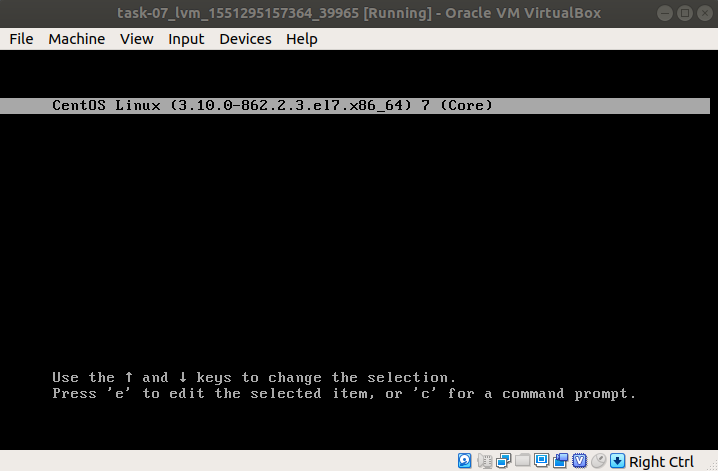
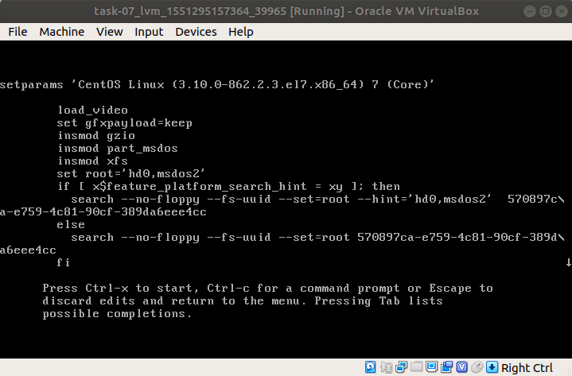
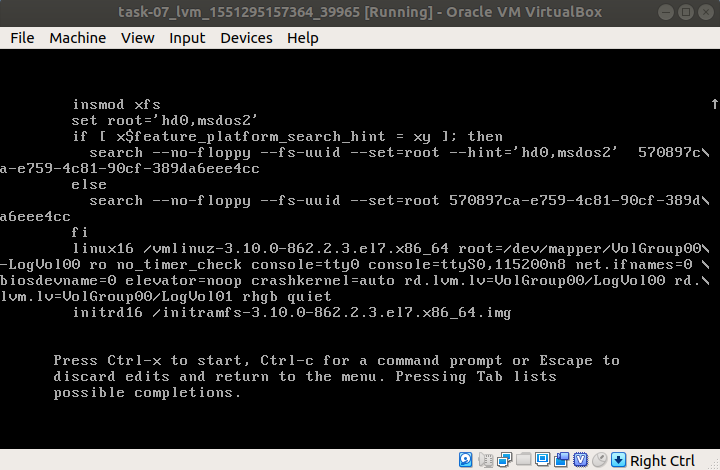
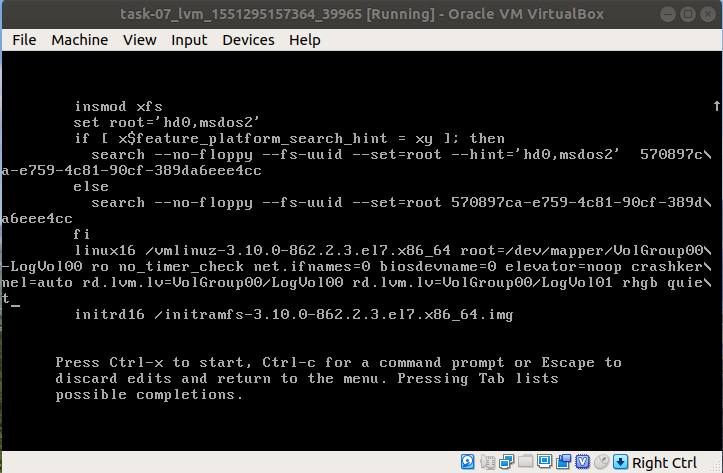

# Домашнее задание №7 "Загрузка системы"

## Способы загрузки системы в однопользовательском режиме

Для загрузки системы в однопользовательском режиме, необходимо в меню выбора ядра системы, нажать клавишу "е". Затем в строке, начинающейся с ```linux16```, в данном примере, удалить параметры ```console=tty0``` и ```console=ttyS0,115200n8```.









#### Способ №1

