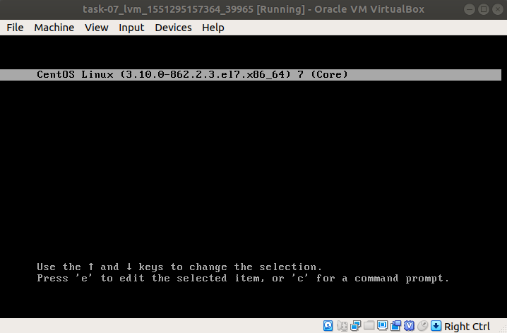
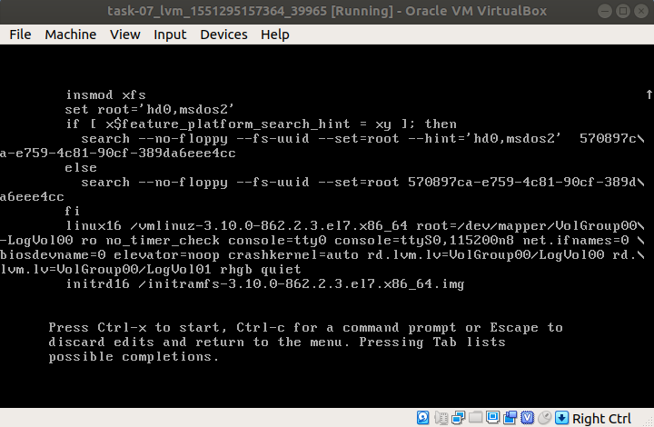
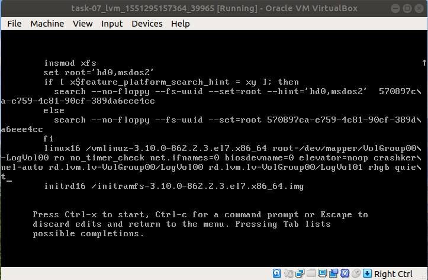
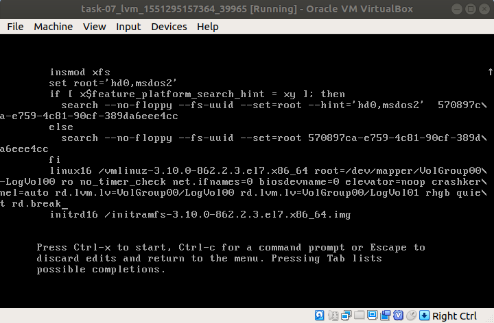
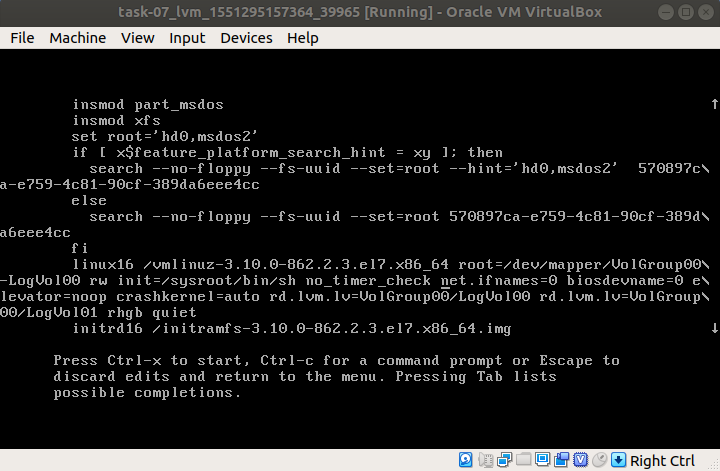
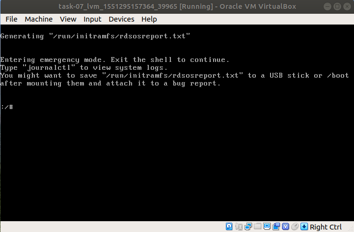
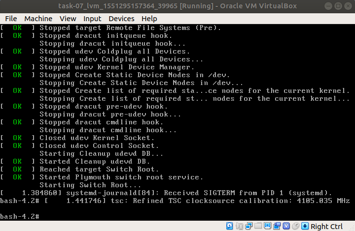

# Домашнее задание №7 "Загрузка системы"

## Способы загрузки системы в однопользовательском режиме

Для загрузки системы в однопользовательском режиме, необходимо в меню загрузки нажать "e".
Из grub опций находим строку, начинающуюся с ```linux16```, в данном примере (редактируемые параметры могут отличаться); удалить параметры ```console=tty0``` и ```console=ttyS0,115200n8```.








Далее рассмотрены методы загрузки системы в однопользовательском режиме.

#### Метод №1 - rd.break

В конце строки, начинающейся с ```linux16```, добавляем rd.break.



Нажимаем ```ctrl+x```, чтобы загрузится с данными параметрами в ```initramfs``` c рутовым shell.
На данном этапе файловая система смонтирована в режиме только чтения, в директорию /sysroot.


Для внесения изменений в ФС, необходимо перемонтировать ее в режим read/write командой:

```# mount -o remount,rw /sysroot```

затем изменить корневой каталог:

```# chroot /sysroot```

После чего, к примеру, можно выполнить смену пароля root пользователя командой:

```# passwd```

Если не используется SELinux, то можно загружаться в систему с новым паролем.
Если SELinux используется (по дефолту в CentOS/RHEL 7 в enforcing mode), то необходимо исправить контекст файла ```/etc/shadow```. Т.к. команда ```passwd``` создает новый ```/etc/shadow``` файл, без контекстов SELinux (отключен в однопользовательском режиме), которые могут вызвать проблемы при загрузке системы.
Для этого нужно проверить нахождение файла ```.autorelabel``` в корне и если его там нет, то создать командой:

```# touch /.autorelabel```

Создание этого файла автоматически выполнит переназначение всех файлов при следующей загрузке системы.
Затем:

```# exit``` - выход из chroot

```# exit``` - выход из корневой оболочки initramfs и перезагрузка системы

В итоге загружаемся в систему с новым рутовым паролем.

#### Метод №2 - init=/sysroot/bin/sh

В строке, начинающейся с ```linux16```, заменить ```ro``` на ```rw init=/sysroot/bin/sh```.

В отличии от предыдущего метода, система сразу монтируется в режим read/write.





Для смены пароля ```root```, необходимо выполнить следующие действия:

```# chroot /sysroot``` - меняем корневой каталог

```# passwd root``` - задаем пароль для root

```# touch /.autorelabel``` - переназначение всех файлов при следующей загрузке системы

```# exit``` - выход из chroot

```# reboot``` - перезагрузка системы

#### Метод №3 - init=/bin/bash

В строке, нащинающейся с ```linux16```, удалить ```rhgb quite``` и добавить ```init=/bin/bash```.




Для смены пароля root:

```# mount -o remount,rw /``` - монтируем рутовый раздел в режим read/write

```# passwd root``` - задаем пароль для root

```# touch /.autorelabel``` - переназначение всех файлов при следующей загрузке системы

```# exec /sbin/init``` - перезагрузка системы