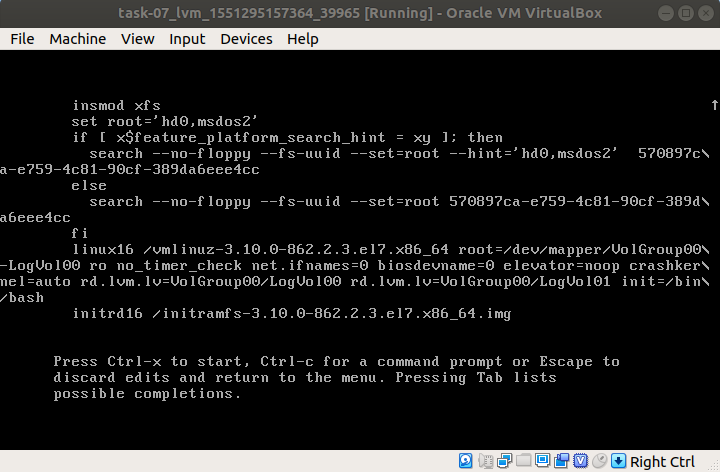

# Домашнее задание №7 "Загрузка системы"

## 1. Способы загрузки системы в однопользовательском режиме

Для загрузки системы в однопользовательском режиме, необходимо в меню загрузки нажать "e".
Из grub опций находим строку, начинающуюся с ```linux16```, в данном примере (редактируемые параметры могут отличаться); удалить параметры ```console=tty0``` и ```console=ttyS0,115200n8```.


Далее рассмотрены методы загрузки системы в однопользовательском режиме.

#### Метод №1 - rd.break

В конце строки, начинающейся с ```linux16```, добавляем rd.break.


Нажимаем ```ctrl+x```, чтобы загрузиться с данными параметрами в ```initramfs```, c рутовым shell.
На данном этапе файловая система смонтирована в режиме только чтения, в директорию /sysroot.


Для внесения изменений в ФС, необходимо перемонтировать ее в режим read/write, командой:

```# mount -o remount,rw /sysroot```

затем изменить корневой каталог:

```# chroot /sysroot```

После чего, к примеру, можно выполнить смену пароля root пользователя, командой:

```# passwd```

Если не используется SELinux, то можно загружаться в систему с новым паролем.
Если SELinux используется (по дефолту в CentOS/RHEL 7 в enforcing mode), то необходимо исправить контекст файла ```/etc/shadow```. Т.к. команда ```passwd``` создает новый ```/etc/shadow``` файл, без контекстов SELinux (отключен в однопользовательском режиме), которые могут вызвать проблемы при загрузке системы.
Для этого нужно проверить нахождение файла ```.autorelabel``` в корне и, если его там нет, то создать командой:

```# touch /.autorelabel```

Создание этого файла автоматически выполнит переназначение всех файлов при следующей загрузке системы.

Затем:

```# exit``` - выход из chroot

```# exit``` - выход из корневой оболочки initramfs и перезагрузка системы

В итоге загружаемся в систему с новым рутовым паролем.

#### Метод №2 - init=/sysroot/bin/sh

В строке, начинающейся с ```linux16```, заменить ```ro``` на ```rw init=/sysroot/bin/sh```.

В отличии от предыдущего метода, система сразу монтируется в режим read/write.


Для смены пароля ```root```, необходимо выполнить следующие действия:

```# chroot /sysroot``` - меняем корневой каталог

```# passwd root``` - задаем пароль для root

```# touch /.autorelabel``` - переназначение всех файлов (контекстов SELinux), при следующей загрузке системы

```# exit``` - выход из chroot

```# reboot``` - перезагрузка системы

#### Метод №3 - init=/bin/bash

В строке, нащинающейся с ```linux16```, удалить ```rhgb quite``` и добавить ```init=/bin/bash```.




Для смены пароля root:

```# mount -o remount,rw /``` - монтируем рутовый раздел в режим read/write

```# passwd root``` - задаем пароль для root

```# touch /.autorelabel``` - переназначение всех файлов (контекстов SELinux), при следующей загрузке системы

```# exec /sbin/init``` - перезагрузка системы

## 2. Установить систему на LVM, после чего переименовать VG

Показать информацию о группах томов:

```
[root@lvm vagrant]# vgs
  VG         #PV #LV #SN Attr   VSize   VFree
  VolGroup00   1   2   0 wz--n- <38.97g    0
```

Переименуем группу томов:

```
[root@lvm vagrant]# vgrename VolGroup00 otusRoot
  Volume group "VolGroup00" successfully renamed to "otusRoot"
```

Далее необходимо изменить файлы конфигураций ```/etc/fstab```, ```/etc/default/grub```, ```/boot/grub2/grub.cfg```:

\# nano /etc/fstab

```
#
# /etc/fstab
# Created by anaconda on Sat May 12 18:50:26 2018
#
# Accessible filesystems, by reference, are maintained under '/dev/disk'
# See man pages fstab(5), findfs(8), mount(8) and/or blkid(8) for more info
#
/dev/mapper/otusRoot-LogVol00 /                       xfs     defaults        0 0
UUID=570897ca-e759-4c81-90cf-389da6eee4cc /boot                   xfs     defaults        0 0
/dev/mapper/otusRoot-LogVol01 swap                    swap    defaults        0 0
```
\# nano /etc/default/grub

```
GRUB_TIMEOUT=1
GRUB_DISTRIBUTOR="$(sed 's, release .*$,,g' /etc/system-release)"
GRUB_DEFAULT=saved
GRUB_DISABLE_SUBMENU=true
GRUB_TERMINAL_OUTPUT="console"
GRUB_CMDLINE_LINUX="no_timer_check console=tty0 console=ttyS0,115200n8 net.ifnames=0 biosdevname=0 elevator=noop crashkernel=auto rd.lvm.lv=otusRo$
GRUB_DISABLE_RECOVERY="true"
```
\# nano /boot/grub2/grub.cfg

```
#
# DO NOT EDIT THIS FILE
#
# It is automatically generated by grub2-mkconfig using templates
# from /etc/grub.d and settings from /etc/default/grub
#

### BEGIN /etc/grub.d/00_header ###
set pager=1

if [ -s $prefix/grubenv ]; then
  load_env
fi
if [ "${next_entry}" ] ; then
   set default="${next_entry}"
   set next_entry=
   save_env next_entry
   set boot_once=true
else
   set default="${saved_entry}"
fi

if [ x"${feature_menuentry_id}" = xy ]; then
  menuentry_id_option="--id"
else
  menuentry_id_option=""
fi

export menuentry_id_option

if [ "${prev_saved_entry}" ]; then
  set saved_entry="${prev_saved_entry}"
  save_env saved_entry
  set prev_saved_entry=
  save_env prev_saved_entry
  set boot_once=true
fi

function savedefault {
  if [ -z "${boot_once}" ]; then
    saved_entry="${chosen}"
    save_env saved_entry
  fi
}

function load_video {
  if [ x$feature_all_video_module = xy ]; then
    insmod all_video
  else
    insmod efi_gop
    insmod efi_uga
    insmod ieee1275_fb
    insmod vbe
    insmod vga
    insmod video_bochs
    insmod video_cirrus
  fi
}

terminal_output console
if [ x$feature_timeout_style = xy ] ; then
  set timeout_style=menu
  set timeout=1
# Fallback normal timeout code in case the timeout_style feature is
# unavailable.
else
  set timeout=1
fi
### END /etc/grub.d/00_header ###

### BEGIN /etc/grub.d/00_tuned ###
set tuned_params=""
set tuned_initrd=""
### END /etc/grub.d/00_tuned ###

### BEGIN /etc/grub.d/01_users ###
if [ -f ${prefix}/user.cfg ]; then
  source ${prefix}/user.cfg
  if [ -n "${GRUB2_PASSWORD}" ]; then
    set superusers="root"
    export superusers
    password_pbkdf2 root ${GRUB2_PASSWORD}
  fi
fi
### END /etc/grub.d/01_users ###

### BEGIN /etc/grub.d/10_linux ###
menuentry 'CentOS Linux (3.10.0-862.2.3.el7.x86_64) 7 (Core)' --class centos --class gnu-linux --class gnu --class os --unrestricted $menuentry_id_option 'gnulinux-3.10.0-862.2.3.el7.x86_64-advanced-b60e9498-0baa-4d9f-90aa-069048217fee' {
	load_video
	set gfxpayload=keep
	insmod gzio
	insmod part_msdos
	insmod xfs
	set root='hd0,msdos2'
	if [ x$feature_platform_search_hint = xy ]; then
	  search --no-floppy --fs-uuid --set=root --hint='hd0,msdos2'  570897ca-e759-4c81-90cf-389da6eee4cc
	else
	  search --no-floppy --fs-uuid --set=root 570897ca-e759-4c81-90cf-389da6eee4cc
	fi
	linux16 /vmlinuz-3.10.0-862.2.3.el7.x86_64 root=/dev/mapper/otusRoot-LogVol00 ro no_timer_check console=tty0 console=ttyS0,115200n8 net.ifnames=0 biosdevname=0 elevator=noop crashkernel=auto rd.lvm.lv=otusRoot/LogVol00 rd.lvm.lv=otusRoot/LogVol01 rhgb quiet 
	initrd16 /initramfs-3.10.0-862.2.3.el7.x86_64.img
}
if [ "x$default" = 'CentOS Linux (3.10.0-862.2.3.el7.x86_64) 7 (Core)' ]; then default='Advanced options for CentOS Linux>CentOS Linux (3.10.0-862.2.3.el7.x86_64) 7 (Core)'; fi;
### END /etc/grub.d/10_linux ###

### BEGIN /etc/grub.d/20_linux_xen ###
### END /etc/grub.d/20_linux_xen ###

### BEGIN /etc/grub.d/20_ppc_terminfo ###
### END /etc/grub.d/20_ppc_terminfo ###

### BEGIN /etc/grub.d/30_os-prober ###
### END /etc/grub.d/30_os-prober ###

### BEGIN /etc/grub.d/40_custom ###
# This file provides an easy way to add custom menu entries.  Simply type the
# menu entries you want to add after this comment.  Be careful not to change
# the 'exec tail' line above.
### END /etc/grub.d/40_custom ###

### BEGIN /etc/grub.d/41_custom ###
if [ -f  ${config_directory}/custom.cfg ]; then
  source ${config_directory}/custom.cfg
elif [ -z "${config_directory}" -a -f  $prefix/custom.cfg ]; then
  source $prefix/custom.cfg;
fi
### END /etc/grub.d/41_custom ###
```

Пересоздаем ```initrd``` образ, чтобы он знал новое название Volume Group:

```# mkinitrd -f -v /boot/initramfs-$(uname -r).img $(uname -r)```

Образ ```initrd``` успешно создан:

```
*** Creating image file done ***
*** Creating initramfs image file '/boot/initramfs-3.10.0-862.2.3.el7.x86_64.img' done ***
```

После чего перезагружаем систему и проверяем переименованную группу томов:

```
[root@lvm vagrant]# vgs
  VG       #PV #LV #SN Attr   VSize   VFree
  otusRoot   1   2   0 wz--n- <38.97g    0
```

## 3. Добавить модуль в initrd

Скрипты модулей хранятся в каталоге ```/usr/lib/dracut/modules.d```. Для добавления своего модуля, создадим в нем директорию ```01test```:

```# mkdir /usr/lib/dracut/modules.d/01test```

Затем в директорию ```01test``` поместим два скрипта:

1. ```module-setup.sh``` - устанавливает модуль и вызывает скрипт

```
#!/bin/bash

check() {
    return 0
}

depends() {
    return 0
}

install() {
    inst_hook cleanup 00 "${moddir}/test.sh"
}
```

2. ```test.sh``` - вызываемый скрипт, в нём рисуется пингвинчик

```
#!/bin/bash

exec 0<>/dev/console 1<>/dev/console 2<>/dev/console
cat <<'msgend'
Hello! You are in dracut module!
 ___________________
< I'm dracut module >
 -------------------
   \
    \
        .--.
       |o_o |
       |:_/ |
      //   \ \
     (|     | )
    /'\_   _/`\
    \___)=(___/
msgend
sleep 10
echo " continuing...."
```

Пересобираем образ initrd:

```# mkinitrd -f -v /boot/initramfs-$(uname -r).img $(uname -r)```

или

```# dracut -f -v```

Можно проверить/посмотреть какие модули загружены в образ:

```
[root@lvm ~]# lsinitrd -m /boot/initramfs-$(uname -r).img | grep test
test
```

Проверить свой модуль можно следующими способами:

1. Перезагрузиться и удалить опции ```rghb``` и ```quiet```.

2. Отредактировать ```grub.cfg```, убрав опции ```rghb``` и ```quiet```.

В итоге, при загрузке, будет пауза на 10 секунд и можно наблюдать пингвина в выводе терминала.


