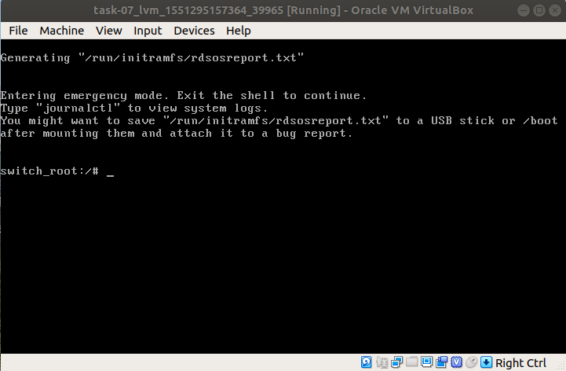

# Домашнее задание №7 "Загрузка системы"

## Способы загрузки системы в однопользовательском режиме

Для загрузки системы в однопользовательском режиме, необходимо в меню выбора ядра, нажать клавишу "е". Затем в строке, начинающейся с ```linux16```, в данном примере (редактируемые параметры могут отличаться), удалить параметры ```console=tty0``` и ```console=ttyS0,115200n8```.


Далее рассмотрены методы загрузки системы в однопользовательском режиме.

#### Метод №1 - init=/bin/bash

В строке, нащинающейся с ```linux16```, удалить ```rhgb quite``` и добавить ```init=/bin/bash```.




Если не удалять ```rhgb quite```, то без подробного вывода на консоль, получим доступ в систему.


