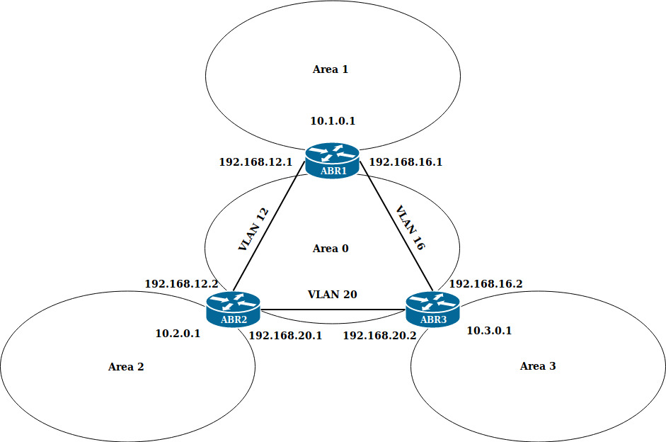
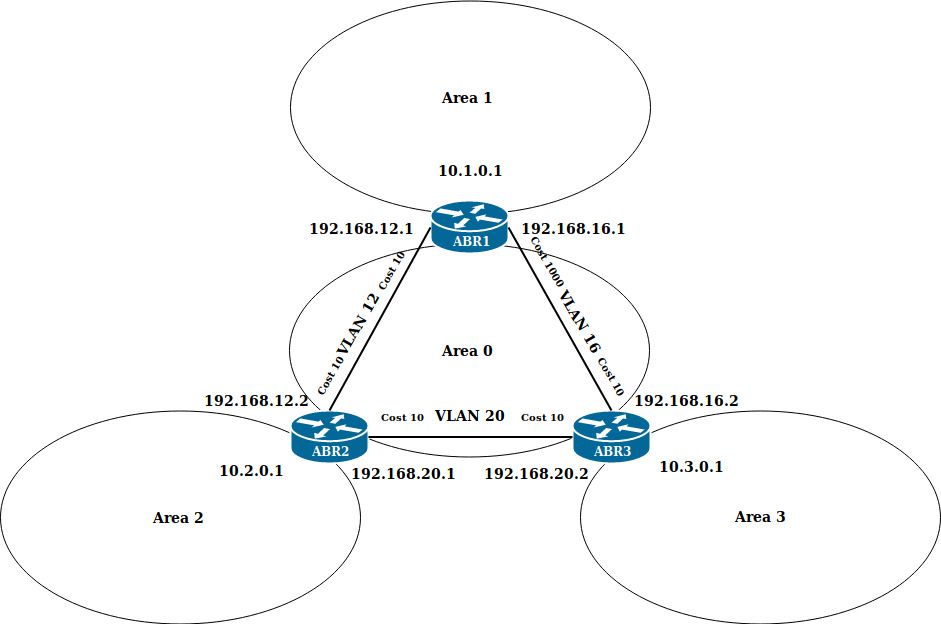
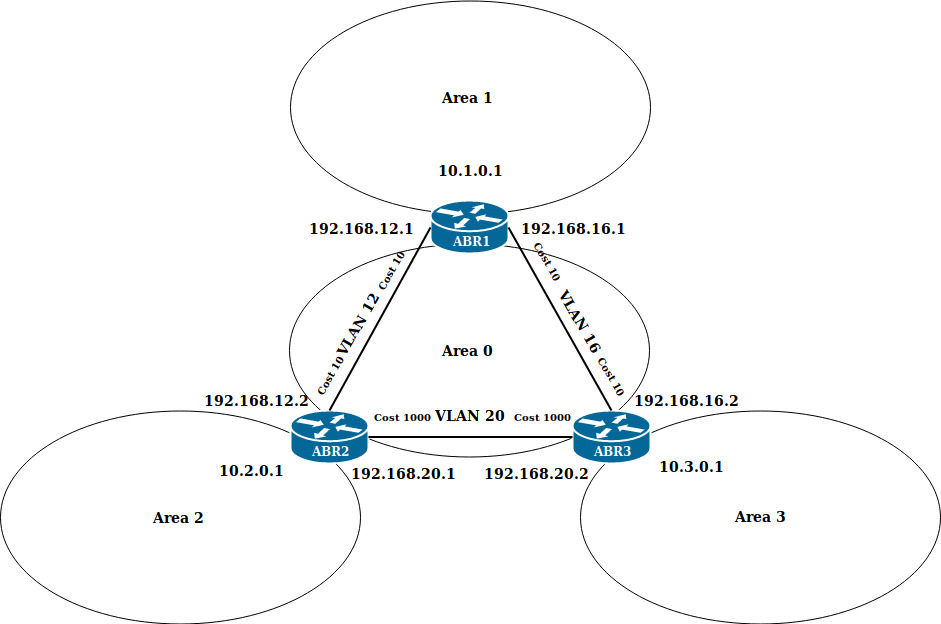

# Домашнее задание №18 "OSPF"

## Описание

- Поднять три виртуалки.
- Объединить их разными vlan.
1. Поднять OSPF между машинами на базе Quagga.
2. Изобразить ассиметричный роутинг.
3. Сделать один из линков "дорогим", но чтобы, при этом, роутинг был симметричным.

### 1. Поднять OSPF между машинами на базе Quagga

Для запуска стенда, необходимо выполнить ```vagrant up``` из директории **[v1](https://github.com/johnTux/otus_linux/tree/master/task-18/v1)**.

В результате получим схему, представленную ниже:



<details>
<summary><code>Конфигурации сетевых интерфейсов</code></summary>

<details>
<summary><code>ABR1</code></summary>

```
[root@ABR1 ~]# ip a
1: lo: <LOOPBACK,UP,LOWER_UP> mtu 65536 qdisc noqueue state UNKNOWN group default qlen 1000
    link/loopback 00:00:00:00:00:00 brd 00:00:00:00:00:00
    inet 127.0.0.1/8 scope host lo
       valid_lft forever preferred_lft forever
    inet6 ::1/128 scope host 
       valid_lft forever preferred_lft forever
2: eth0: <BROADCAST,MULTICAST,UP,LOWER_UP> mtu 1500 qdisc pfifo_fast state UP group default qlen 1000
    link/ether 52:54:00:75:dc:3d brd ff:ff:ff:ff:ff:ff
    inet 10.0.2.15/24 brd 10.0.2.255 scope global noprefixroute dynamic eth0
       valid_lft 86190sec preferred_lft 86190sec
    inet6 fe80::5054:ff:fe75:dc3d/64 scope link 
       valid_lft forever preferred_lft forever
3: eth1: <BROADCAST,MULTICAST,UP,LOWER_UP> mtu 1500 qdisc pfifo_fast state UP group default qlen 1000
    link/ether 08:00:27:5d:1b:25 brd ff:ff:ff:ff:ff:ff
    inet6 fe80::9a44:6114:eaed:ab74/64 scope link noprefixroute 
       valid_lft forever preferred_lft forever
4: eth2: <BROADCAST,MULTICAST,UP,LOWER_UP> mtu 1500 qdisc pfifo_fast state UP group default qlen 1000
    link/ether 08:00:27:5f:a1:19 brd ff:ff:ff:ff:ff:ff
    inet6 fe80::6303:f9a8:165c:3e68/64 scope link noprefixroute 
       valid_lft forever preferred_lft forever
5: eth3: <BROADCAST,MULTICAST,UP,LOWER_UP> mtu 1500 qdisc pfifo_fast state UP group default qlen 1000
    link/ether 08:00:27:59:6c:42 brd ff:ff:ff:ff:ff:ff
    inet 10.1.0.1/24 brd 10.1.0.255 scope global noprefixroute eth3
       valid_lft forever preferred_lft forever
    inet6 fe80::a00:27ff:fe59:6c42/64 scope link 
       valid_lft forever preferred_lft forever
6: vlan12@eth1: <BROADCAST,MULTICAST,UP,LOWER_UP> mtu 1500 qdisc noqueue state UP group default qlen 1000
    link/ether 08:00:27:5d:1b:25 brd ff:ff:ff:ff:ff:ff
    inet 192.168.12.1/30 brd 192.168.12.3 scope global noprefixroute vlan12
       valid_lft forever preferred_lft forever
    inet6 fe80::a00:27ff:fe5d:1b25/64 scope link 
       valid_lft forever preferred_lft forever
7: vlan16@eth2: <BROADCAST,MULTICAST,UP,LOWER_UP> mtu 1500 qdisc noqueue state UP group default qlen 1000
    link/ether 08:00:27:5f:a1:19 brd ff:ff:ff:ff:ff:ff
    inet 192.168.16.1/30 brd 192.168.16.3 scope global noprefixroute vlan16
       valid_lft forever preferred_lft forever
    inet6 fe80::a00:27ff:fe5f:a119/64 scope link 
       valid_lft forever preferred_lft forever
```

</details>

<details>
<summary><code>ABR2</code></summary>

```
[root@ABR2 ~]# ip a
1: lo: <LOOPBACK,UP,LOWER_UP> mtu 65536 qdisc noqueue state UNKNOWN group default qlen 1000
    link/loopback 00:00:00:00:00:00 brd 00:00:00:00:00:00
    inet 127.0.0.1/8 scope host lo
       valid_lft forever preferred_lft forever
    inet6 ::1/128 scope host 
       valid_lft forever preferred_lft forever
2: eth0: <BROADCAST,MULTICAST,UP,LOWER_UP> mtu 1500 qdisc pfifo_fast state UP group default qlen 1000
    link/ether 52:54:00:75:dc:3d brd ff:ff:ff:ff:ff:ff
    inet 10.0.2.15/24 brd 10.0.2.255 scope global noprefixroute dynamic eth0
       valid_lft 86113sec preferred_lft 86113sec
    inet6 fe80::5054:ff:fe75:dc3d/64 scope link 
       valid_lft forever preferred_lft forever
3: eth1: <BROADCAST,MULTICAST,UP,LOWER_UP> mtu 1500 qdisc pfifo_fast state UP group default qlen 1000
    link/ether 08:00:27:ce:d9:66 brd ff:ff:ff:ff:ff:ff
    inet6 fe80::e3dd:e835:559e:dcfa/64 scope link noprefixroute 
       valid_lft forever preferred_lft forever
4: eth2: <BROADCAST,MULTICAST,UP,LOWER_UP> mtu 1500 qdisc pfifo_fast state UP group default qlen 1000
    link/ether 08:00:27:87:82:d2 brd ff:ff:ff:ff:ff:ff
    inet6 fe80::f79e:d57a:c437:4cc7/64 scope link noprefixroute 
       valid_lft forever preferred_lft forever
5: eth3: <BROADCAST,MULTICAST,UP,LOWER_UP> mtu 1500 qdisc pfifo_fast state UP group default qlen 1000
    link/ether 08:00:27:21:68:0a brd ff:ff:ff:ff:ff:ff
    inet 10.2.0.1/24 brd 10.2.0.255 scope global noprefixroute eth3
       valid_lft forever preferred_lft forever
    inet6 fe80::a00:27ff:fe21:680a/64 scope link 
       valid_lft forever preferred_lft forever
6: vlan12@eth1: <BROADCAST,MULTICAST,UP,LOWER_UP> mtu 1500 qdisc noqueue state UP group default qlen 1000
    link/ether 08:00:27:ce:d9:66 brd ff:ff:ff:ff:ff:ff
    inet 192.168.12.2/30 brd 192.168.12.3 scope global noprefixroute vlan12
       valid_lft forever preferred_lft forever
    inet6 fe80::a00:27ff:fece:d966/64 scope link 
       valid_lft forever preferred_lft forever
7: vlan20@eth2: <BROADCAST,MULTICAST,UP,LOWER_UP> mtu 1500 qdisc noqueue state UP group default qlen 1000
    link/ether 08:00:27:87:82:d2 brd ff:ff:ff:ff:ff:ff
    inet 192.168.20.1/30 brd 192.168.20.3 scope global noprefixroute vlan20
       valid_lft forever preferred_lft forever
    inet6 fe80::a00:27ff:fe87:82d2/64 scope link 
       valid_lft forever preferred_lft forever
```

</details>

<details>
<summary><code>ABR3</code></summary>

```
[root@ABR3 ~]# ip a
1: lo: <LOOPBACK,UP,LOWER_UP> mtu 65536 qdisc noqueue state UNKNOWN group default qlen 1000
    link/loopback 00:00:00:00:00:00 brd 00:00:00:00:00:00
    inet 127.0.0.1/8 scope host lo
       valid_lft forever preferred_lft forever
    inet6 ::1/128 scope host 
       valid_lft forever preferred_lft forever
2: eth0: <BROADCAST,MULTICAST,UP,LOWER_UP> mtu 1500 qdisc pfifo_fast state UP group default qlen 1000
    link/ether 52:54:00:75:dc:3d brd ff:ff:ff:ff:ff:ff
    inet 10.0.2.15/24 brd 10.0.2.255 scope global noprefixroute dynamic eth0
       valid_lft 86222sec preferred_lft 86222sec
    inet6 fe80::5054:ff:fe75:dc3d/64 scope link 
       valid_lft forever preferred_lft forever
3: eth1: <BROADCAST,MULTICAST,UP,LOWER_UP> mtu 1500 qdisc pfifo_fast state UP group default qlen 1000
    link/ether 08:00:27:1d:e9:4b brd ff:ff:ff:ff:ff:ff
    inet6 fe80::fb87:44d2:865e:30c9/64 scope link noprefixroute 
       valid_lft forever preferred_lft forever
4: eth2: <BROADCAST,MULTICAST,UP,LOWER_UP> mtu 1500 qdisc pfifo_fast state UP group default qlen 1000
    link/ether 08:00:27:a6:43:37 brd ff:ff:ff:ff:ff:ff
    inet6 fe80::7063:c34e:d7b5:7150/64 scope link noprefixroute 
       valid_lft forever preferred_lft forever
5: eth3: <BROADCAST,MULTICAST,UP,LOWER_UP> mtu 1500 qdisc pfifo_fast state UP group default qlen 1000
    link/ether 08:00:27:4c:29:a0 brd ff:ff:ff:ff:ff:ff
    inet 10.3.0.1/24 brd 10.3.0.255 scope global noprefixroute eth3
       valid_lft forever preferred_lft forever
    inet6 fe80::a00:27ff:fe4c:29a0/64 scope link 
       valid_lft forever preferred_lft forever
6: vlan16@eth1: <BROADCAST,MULTICAST,UP,LOWER_UP> mtu 1500 qdisc noqueue state UP group default qlen 1000
    link/ether 08:00:27:1d:e9:4b brd ff:ff:ff:ff:ff:ff
    inet 192.168.16.2/30 brd 192.168.16.3 scope global noprefixroute vlan16
       valid_lft forever preferred_lft forever
    inet6 fe80::a00:27ff:fe1d:e94b/64 scope link 
       valid_lft forever preferred_lft forever
7: vlan20@eth2: <BROADCAST,MULTICAST,UP,LOWER_UP> mtu 1500 qdisc noqueue state UP group default qlen 1000
    link/ether 08:00:27:a6:43:37 brd ff:ff:ff:ff:ff:ff
    inet 192.168.20.2/30 brd 192.168.20.3 scope global noprefixroute vlan20
       valid_lft forever preferred_lft forever
    inet6 fe80::a00:27ff:fea6:4337/64 scope link 
       valid_lft forever preferred_lft forever
```

</details>
</details>

<details>
<summary><code>Конфигурационные файлы в директории /etc/quagga роутера ABR1</code></summary>

<details>
<summary><code>daemons</code></summary>

```
zebra=yes
bgpd=no
ospfd=yes
ospf6d=no
ripd=no
ripngd=no
```

</details>

<details>
<summary><code>zebra.conf</code></summary>

```
hostname ABR1

log file /var/log/quagga/quagga.log

interface eth3
 description ABR1
 ip address 10.1.0.1/24
 ipv6 nd suppress-ra

interface vlan12
 description to site ABR2
 ip address 192.168.12.1/30
 ipv6 nd suppress-ra

interface vlan16
 description to site ABR3
 ip address 192.168.16.1/30
 ipv6 nd suppress-ra

line vty
```

</details>

<details>
<summary><code>ospfd.conf</code></summary>

```
hostname ABR1

log file /var/log/quagga/ospfd.log

router ospf
 ospf router-id 192.168.12.1
 redistribute connected
 network 10.1.0.0/24 area 1
 network 192.168.12.0/30 area 0
 network 192.168.16.0/30 area 0

line vty
```

</details>
</details>

<details>
<summary><code>Конфигурационные файлы в директории /etc/quagga роутера ABR2</code></summary>

<details>
<summary><code>daemons</code></summary>

```
zebra=yes
bgpd=no
ospfd=yes
ospf6d=no
ripd=no
ripngd=no
```

</details>

<details>
<summary><code>zebra.conf</code></summary>

```
hostname ABR2

log file /var/log/quagga/quagga.log

interface eth3
 description ABR2
 ip address 10.2.0.1/24
 ipv6 nd suppress-ra

interface vlan12
 description to site ABR1
 ip address 192.168.12.2/30
 ipv6 nd suppress-ra

interface vlan20
 description to site ABR3
 ip address 192.168.20.1/30
 ipv6 nd suppress-ra

line vty
```

</details>

<details>
<summary><code>ospfd.conf</code></summary>

```
hostname ABR2

log file /var/log/quagga/ospfd.log

router ospf
 ospf router-id 192.168.12.2
 redistribute connected
 network 10.2.0.0/24 area 2
 network 192.168.12.0/30 area 0
 network 192.168.20.0/30 area 0

line vty
```

</details>
</details>

<details>
<summary><code>Конфигурационные файлы в директории /etc/quagga роутера ABR3</code></summary>

<details>
<summary><code>daemons</code></summary>

```
zebra=yes
bgpd=no
ospfd=yes
ospf6d=no
ripd=no
ripngd=no
```

</details>

<details>
<summary><code>zebra.conf</code></summary>

```
hostname ABR3

log file /var/log/quagga/quagga.log

interface eth3
 description ABR3
 ip address 10.3.0.1/24
 ipv6 nd suppress-ra

interface vlan16
 description to site ABR1
 ip address 192.168.16.2/30
 ipv6 nd suppress-ra

interface vlan20
 description to site ABR2
 ip address 192.168.20.2/30
 ipv6 nd suppress-ra

line vty
```

</details>

<details>
<summary><code>ospfd.conf</code></summary>

```
hostname ABR3

log file /var/log/quagga/ospfd.log

router ospf
 ospf router-id 192.168.16.2
 redistribute connected
 network 10.3.0.0/24 area 3
 network 192.168.16.0/30 area 0
 network 192.168.20.0/30 area 0

line vty
```

</details>
</details>

<details>
<summary><code>Результаты работы стенда</code></summary>

Трафик идет напрямую от **ABR1** к **ABR3**:

```
[root@ABR1 ~]# traceroute 10.3.0.1
traceroute to 10.3.0.1 (10.3.0.1), 30 hops max, 60 byte packets
 1  10.3.0.1 (10.3.0.1)  0.583 ms  0.250 ms  0.428 ms
```

Трафик идет напрямую от **ABR3** к **ABR1**:

```
[root@ABR3 ~]# traceroute 10.1.0.1
traceroute to 10.1.0.1 (10.1.0.1), 30 hops max, 60 byte packets
 1  10.1.0.1 (10.1.0.1)  0.602 ms  0.465 ms  0.361 ms
```

</details>

### 2. Изобразить ассиметричный роутинг

Для запуска стенда, необходимо выполнить ```vagrant up``` из директории **[v2](https://github.com/johnTux/otus_linux/tree/master/task-18/v2)**.

В результате получим схему, представленную ниже:



Для выполнения условия задачи, установил стоимость **1000** на интерфейс **vlan 16** роутера **ABR1**.

<details>
<summary><code>Конфигурации сетевых интерфейсов</code></summary>

<details>
<summary><code>ABR1</code></summary>

```
[root@ABR1 ~]# ip a
1: lo: <LOOPBACK,UP,LOWER_UP> mtu 65536 qdisc noqueue state UNKNOWN group default qlen 1000
    link/loopback 00:00:00:00:00:00 brd 00:00:00:00:00:00
    inet 127.0.0.1/8 scope host lo
       valid_lft forever preferred_lft forever
    inet6 ::1/128 scope host 
       valid_lft forever preferred_lft forever
2: eth0: <BROADCAST,MULTICAST,UP,LOWER_UP> mtu 1500 qdisc pfifo_fast state UP group default qlen 1000
    link/ether 52:54:00:75:dc:3d brd ff:ff:ff:ff:ff:ff
    inet 10.0.2.15/24 brd 10.0.2.255 scope global noprefixroute dynamic eth0
       valid_lft 85817sec preferred_lft 85817sec
    inet6 fe80::5054:ff:fe75:dc3d/64 scope link 
       valid_lft forever preferred_lft forever
3: eth1: <BROADCAST,MULTICAST,UP,LOWER_UP> mtu 1500 qdisc pfifo_fast state UP group default qlen 1000
    link/ether 08:00:27:9e:46:62 brd ff:ff:ff:ff:ff:ff
    inet6 fe80::8d24:e320:d876:1197/64 scope link noprefixroute 
       valid_lft forever preferred_lft forever
4: eth2: <BROADCAST,MULTICAST,UP,LOWER_UP> mtu 1500 qdisc pfifo_fast state UP group default qlen 1000
    link/ether 08:00:27:49:6d:d8 brd ff:ff:ff:ff:ff:ff
    inet6 fe80::1b22:caa9:e9b8:cded/64 scope link noprefixroute 
       valid_lft forever preferred_lft forever
5: eth3: <BROADCAST,MULTICAST,UP,LOWER_UP> mtu 1500 qdisc pfifo_fast state UP group default qlen 1000
    link/ether 08:00:27:76:91:88 brd ff:ff:ff:ff:ff:ff
    inet 10.1.0.1/24 brd 10.1.0.255 scope global noprefixroute eth3
       valid_lft forever preferred_lft forever
    inet6 fe80::a00:27ff:fe76:9188/64 scope link 
       valid_lft forever preferred_lft forever
6: vlan12@eth1: <BROADCAST,MULTICAST,UP,LOWER_UP> mtu 1500 qdisc noqueue state UP group default qlen 1000
    link/ether 08:00:27:9e:46:62 brd ff:ff:ff:ff:ff:ff
    inet 192.168.12.1/30 brd 192.168.12.3 scope global noprefixroute vlan12
       valid_lft forever preferred_lft forever
    inet6 fe80::a00:27ff:fe9e:4662/64 scope link 
       valid_lft forever preferred_lft forever
7: vlan16@eth2: <BROADCAST,MULTICAST,UP,LOWER_UP> mtu 1500 qdisc noqueue state UP group default qlen 1000
    link/ether 08:00:27:49:6d:d8 brd ff:ff:ff:ff:ff:ff
    inet 192.168.16.1/30 brd 192.168.16.3 scope global noprefixroute vlan16
       valid_lft forever preferred_lft forever
    inet6 fe80::a00:27ff:fe49:6dd8/64 scope link 
       valid_lft forever preferred_lft forever
```

</details>

<details>
<summary><code>ABR2</code></summary>

```
[root@ABR2 ~]# ip a
1: lo: <LOOPBACK,UP,LOWER_UP> mtu 65536 qdisc noqueue state UNKNOWN group default qlen 1000
    link/loopback 00:00:00:00:00:00 brd 00:00:00:00:00:00
    inet 127.0.0.1/8 scope host lo
       valid_lft forever preferred_lft forever
    inet6 ::1/128 scope host 
       valid_lft forever preferred_lft forever
2: eth0: <BROADCAST,MULTICAST,UP,LOWER_UP> mtu 1500 qdisc pfifo_fast state UP group default qlen 1000
    link/ether 52:54:00:75:dc:3d brd ff:ff:ff:ff:ff:ff
    inet 10.0.2.15/24 brd 10.0.2.255 scope global noprefixroute dynamic eth0
       valid_lft 85860sec preferred_lft 85860sec
    inet6 fe80::5054:ff:fe75:dc3d/64 scope link 
       valid_lft forever preferred_lft forever
3: eth1: <BROADCAST,MULTICAST,UP,LOWER_UP> mtu 1500 qdisc pfifo_fast state UP group default qlen 1000
    link/ether 08:00:27:0b:73:3d brd ff:ff:ff:ff:ff:ff
    inet6 fe80::f58e:195a:ceae:949a/64 scope link noprefixroute 
       valid_lft forever preferred_lft forever
4: eth2: <BROADCAST,MULTICAST,UP,LOWER_UP> mtu 1500 qdisc pfifo_fast state UP group default qlen 1000
    link/ether 08:00:27:21:72:3d brd ff:ff:ff:ff:ff:ff
    inet6 fe80::97e:fa77:eccf:ab03/64 scope link noprefixroute 
       valid_lft forever preferred_lft forever
5: eth3: <BROADCAST,MULTICAST,UP,LOWER_UP> mtu 1500 qdisc pfifo_fast state UP group default qlen 1000
    link/ether 08:00:27:05:7c:67 brd ff:ff:ff:ff:ff:ff
    inet 10.2.0.1/24 brd 10.2.0.255 scope global noprefixroute eth3
       valid_lft forever preferred_lft forever
    inet6 fe80::a00:27ff:fe05:7c67/64 scope link 
       valid_lft forever preferred_lft forever
6: vlan12@eth1: <BROADCAST,MULTICAST,UP,LOWER_UP> mtu 1500 qdisc noqueue state UP group default qlen 1000
    link/ether 08:00:27:0b:73:3d brd ff:ff:ff:ff:ff:ff
    inet 192.168.12.2/30 brd 192.168.12.3 scope global noprefixroute vlan12
       valid_lft forever preferred_lft forever
    inet6 fe80::a00:27ff:fe0b:733d/64 scope link 
       valid_lft forever preferred_lft forever
7: vlan20@eth2: <BROADCAST,MULTICAST,UP,LOWER_UP> mtu 1500 qdisc noqueue state UP group default qlen 1000
    link/ether 08:00:27:21:72:3d brd ff:ff:ff:ff:ff:ff
    inet 192.168.20.1/30 brd 192.168.20.3 scope global noprefixroute vlan20
       valid_lft forever preferred_lft forever
    inet6 fe80::a00:27ff:fe21:723d/64 scope link 
       valid_lft forever preferred_lft forever
```

</details>

<details>
<summary><code>ABR3</code></summary>

```
[root@ABR3 ~]# ip a
1: lo: <LOOPBACK,UP,LOWER_UP> mtu 65536 qdisc noqueue state UNKNOWN group default qlen 1000
    link/loopback 00:00:00:00:00:00 brd 00:00:00:00:00:00
    inet 127.0.0.1/8 scope host lo
       valid_lft forever preferred_lft forever
    inet6 ::1/128 scope host 
       valid_lft forever preferred_lft forever
2: eth0: <BROADCAST,MULTICAST,UP,LOWER_UP> mtu 1500 qdisc pfifo_fast state UP group default qlen 1000
    link/ether 52:54:00:75:dc:3d brd ff:ff:ff:ff:ff:ff
    inet 10.0.2.15/24 brd 10.0.2.255 scope global noprefixroute dynamic eth0
       valid_lft 85908sec preferred_lft 85908sec
    inet6 fe80::5054:ff:fe75:dc3d/64 scope link 
       valid_lft forever preferred_lft forever
3: eth1: <BROADCAST,MULTICAST,UP,LOWER_UP> mtu 1500 qdisc pfifo_fast state UP group default qlen 1000
    link/ether 08:00:27:74:e3:db brd ff:ff:ff:ff:ff:ff
    inet6 fe80::31b2:3b96:fd36:510a/64 scope link noprefixroute 
       valid_lft forever preferred_lft forever
4: eth2: <BROADCAST,MULTICAST,UP,LOWER_UP> mtu 1500 qdisc pfifo_fast state UP group default qlen 1000
    link/ether 08:00:27:1d:db:53 brd ff:ff:ff:ff:ff:ff
    inet6 fe80::7058:8e9f:947e:9c4a/64 scope link noprefixroute 
       valid_lft forever preferred_lft forever
5: eth3: <BROADCAST,MULTICAST,UP,LOWER_UP> mtu 1500 qdisc pfifo_fast state UP group default qlen 1000
    link/ether 08:00:27:45:5e:0b brd ff:ff:ff:ff:ff:ff
    inet 10.3.0.1/24 brd 10.3.0.255 scope global noprefixroute eth3
       valid_lft forever preferred_lft forever
    inet6 fe80::a00:27ff:fe45:5e0b/64 scope link 
       valid_lft forever preferred_lft forever
6: vlan16@eth1: <BROADCAST,MULTICAST,UP,LOWER_UP> mtu 1500 qdisc noqueue state UP group default qlen 1000
    link/ether 08:00:27:74:e3:db brd ff:ff:ff:ff:ff:ff
    inet 192.168.16.2/30 brd 192.168.16.3 scope global noprefixroute vlan16
       valid_lft forever preferred_lft forever
    inet6 fe80::a00:27ff:fe74:e3db/64 scope link 
       valid_lft forever preferred_lft forever
7: vlan20@eth2: <BROADCAST,MULTICAST,UP,LOWER_UP> mtu 1500 qdisc noqueue state UP group default qlen 1000
    link/ether 08:00:27:1d:db:53 brd ff:ff:ff:ff:ff:ff
    inet 192.168.20.2/30 brd 192.168.20.3 scope global noprefixroute vlan20
       valid_lft forever preferred_lft forever
    inet6 fe80::a00:27ff:fe1d:db53/64 scope link 
       valid_lft forever preferred_lft forever
```

</details>
</details>

<details>
<summary><code>Конфигурационные файлы в директории /etc/quagga роутера ABR1</code></summary>

<details>
<summary><code>daemons</code></summary>

```
zebra=yes
bgpd=no
ospfd=yes
ospf6d=no
ripd=no
ripngd=no
```

</details>

<details>
<summary><code>zebra.conf</code></summary>

```
hostname ABR1

log file /var/log/quagga/quagga.log

interface eth3
 description ABR1
 ip address 10.1.0.1/24
 ipv6 nd suppress-ra

interface vlan12
 description to site ABR2
 ip address 192.168.12.1/30
 ipv6 nd suppress-ra

interface vlan16
 description to site ABR3
 ip address 192.168.16.1/30
 ipv6 nd suppress-ra

line vty
```

</details>

<details>
<summary><code>ospfd.conf</code></summary>

```
hostname ABR1

log file /var/log/quagga/ospfd.log

interface vlan16
 ip ospf cost 1000

router ospf
 ospf router-id 192.168.12.1
 redistribute connected
 network 10.1.0.0/24 area 1
 network 192.168.12.0/30 area 0
 network 192.168.16.0/30 area 0

line vty
```

</details>
</details>

<details>
<summary><code>Конфигурационные файлы в директории /etc/quagga роутера ABR2</code></summary>

<details>
<summary><code>daemons</code></summary>

```
zebra=yes
bgpd=no
ospfd=yes
ospf6d=no
ripd=no
ripngd=no
```

</details>

<details>
<summary><code>zebra.conf</code></summary>

```
hostname ABR2

log file /var/log/quagga/quagga.log

interface eth3
 description ABR2
 ip address 10.2.0.1/24
 ipv6 nd suppress-ra

interface vlan12
 description to site ABR1
 ip address 192.168.12.2/30
 ipv6 nd suppress-ra

interface vlan20
 description to site ABR3
 ip address 192.168.20.1/30
 ipv6 nd suppress-ra

line vty
```

</details>

<details>
<summary><code>ospfd.conf</code></summary>

```
hostname ABR2

log file /var/log/quagga/ospfd.log

router ospf
 ospf router-id 192.168.12.2
 redistribute connected
 network 10.2.0.0/24 area 2
 network 192.168.12.0/30 area 0
 network 192.168.20.0/30 area 0

line vty
```

</details>
</details>

<details>
<summary><code>Конфигурационные файлы в директории /etc/quagga роутера ABR3</code></summary>

<details>
<summary><code>daemons</code></summary>

```
zebra=yes
bgpd=no
ospfd=yes
ospf6d=no
ripd=no
ripngd=no
```

</details>

<details>
<summary><code>zebra.conf</code></summary>

```
hostname ABR3

log file /var/log/quagga/quagga.log

interface eth3
 description ABR3
 ip address 10.3.0.1/24
 ipv6 nd suppress-ra

interface vlan16
 description to site ABR1
 ip address 192.168.16.2/30
 ipv6 nd suppress-ra

interface vlan20
 description to site ABR2
 ip address 192.168.20.2/30
 ipv6 nd suppress-ra

line vty
```

</details>

<details>
<summary><code>ospfd.conf</code></summary>

```
hostname ABR3

log file /var/log/quagga/ospfd.log

router ospf
 ospf router-id 192.168.16.2
 redistribute connected
 network 10.3.0.0/24 area 3
 network 192.168.16.0/30 area 0
 network 192.168.20.0/30 area 0

line vty
```

</details>
</details>

<details>
<summary><code>Результаты работы стенда</code></summary>

В данном случае трафик идет напрямую от **ABR3** к **ABR1**:

```
[root@ABR3 ~]# traceroute 10.1.0.1
traceroute to 10.1.0.1 (10.1.0.1), 30 hops max, 60 byte packets
 1  10.1.0.1 (10.1.0.1)  0.643 ms  0.387 ms  0.400 ms
```

Из-за стоимости маршрута трафик идет от **ABR1** к **ABR3** через **ABR2**:

```
[root@ABR1 ~]# traceroute 10.3.0.1
traceroute to 10.3.0.1 (10.3.0.1), 30 hops max, 60 byte packets
 1  192.168.12.2 (192.168.12.2)  1.353 ms  0.309 ms  0.590 ms
 2  10.3.0.1 (10.3.0.1)  0.940 ms  0.724 ms  0.878 ms
```

</details>

### 3. Сделать один из линков "дорогим", но чтобы, при этом, роутинг был симметричным

Для запуска стенда, необходимо выполнить ```vagrant up``` из директории **[v3](https://github.com/johnTux/otus_linux/tree/master/task-18/v3)**.

В результате получим схему, представленную ниже:



Для выполнения условия задачи, установил стоимость **1000** на интерфейс **vlan 20** роутеров **ABR2** и **ABR3**.

<details>
<summary><code>Конфигурации сетевых интерфейсов</code></summary>

<details>
<summary><code>ABR1</code></summary>

```
[root@ABR1 ~]# ip a
1: lo: <LOOPBACK,UP,LOWER_UP> mtu 65536 qdisc noqueue state UNKNOWN group default qlen 1000
    link/loopback 00:00:00:00:00:00 brd 00:00:00:00:00:00
    inet 127.0.0.1/8 scope host lo
       valid_lft forever preferred_lft forever
    inet6 ::1/128 scope host 
       valid_lft forever preferred_lft forever
2: eth0: <BROADCAST,MULTICAST,UP,LOWER_UP> mtu 1500 qdisc pfifo_fast state UP group default qlen 1000
    link/ether 52:54:00:75:dc:3d brd ff:ff:ff:ff:ff:ff
    inet 10.0.2.15/24 brd 10.0.2.255 scope global noprefixroute dynamic eth0
       valid_lft 86179sec preferred_lft 86179sec
    inet6 fe80::5054:ff:fe75:dc3d/64 scope link 
       valid_lft forever preferred_lft forever
3: eth1: <BROADCAST,MULTICAST,UP,LOWER_UP> mtu 1500 qdisc pfifo_fast state UP group default qlen 1000
    link/ether 08:00:27:36:4e:39 brd ff:ff:ff:ff:ff:ff
    inet6 fe80::47bf:ec94:c102:104f/64 scope link noprefixroute 
       valid_lft forever preferred_lft forever
4: eth2: <BROADCAST,MULTICAST,UP,LOWER_UP> mtu 1500 qdisc pfifo_fast state UP group default qlen 1000
    link/ether 08:00:27:76:e0:a5 brd ff:ff:ff:ff:ff:ff
    inet6 fe80::4724:6f37:19e:af1d/64 scope link noprefixroute 
       valid_lft forever preferred_lft forever
5: eth3: <BROADCAST,MULTICAST,UP,LOWER_UP> mtu 1500 qdisc pfifo_fast state UP group default qlen 1000
    link/ether 08:00:27:74:c7:d4 brd ff:ff:ff:ff:ff:ff
    inet 10.1.0.1/24 brd 10.1.0.255 scope global noprefixroute eth3
       valid_lft forever preferred_lft forever
    inet6 fe80::a00:27ff:fe74:c7d4/64 scope link 
       valid_lft forever preferred_lft forever
6: vlan12@eth1: <BROADCAST,MULTICAST,UP,LOWER_UP> mtu 1500 qdisc noqueue state UP group default qlen 1000
    link/ether 08:00:27:36:4e:39 brd ff:ff:ff:ff:ff:ff
    inet 192.168.12.1/30 brd 192.168.12.3 scope global noprefixroute vlan12
       valid_lft forever preferred_lft forever
    inet6 fe80::a00:27ff:fe36:4e39/64 scope link 
       valid_lft forever preferred_lft forever
7: vlan16@eth2: <BROADCAST,MULTICAST,UP,LOWER_UP> mtu 1500 qdisc noqueue state UP group default qlen 1000
    link/ether 08:00:27:76:e0:a5 brd ff:ff:ff:ff:ff:ff
    inet 192.168.16.1/30 brd 192.168.16.3 scope global noprefixroute vlan16
       valid_lft forever preferred_lft forever
    inet6 fe80::a00:27ff:fe76:e0a5/64 scope link 
       valid_lft forever preferred_lft forever
```

</details>

<details>
<summary><code>ABR2</code></summary>

```
[root@ABR2 ~]# ip a
1: lo: <LOOPBACK,UP,LOWER_UP> mtu 65536 qdisc noqueue state UNKNOWN group default qlen 1000
    link/loopback 00:00:00:00:00:00 brd 00:00:00:00:00:00
    inet 127.0.0.1/8 scope host lo
       valid_lft forever preferred_lft forever
    inet6 ::1/128 scope host 
       valid_lft forever preferred_lft forever
2: eth0: <BROADCAST,MULTICAST,UP,LOWER_UP> mtu 1500 qdisc pfifo_fast state UP group default qlen 1000
    link/ether 52:54:00:75:dc:3d brd ff:ff:ff:ff:ff:ff
    inet 10.0.2.15/24 brd 10.0.2.255 scope global noprefixroute dynamic eth0
       valid_lft 86205sec preferred_lft 86205sec
    inet6 fe80::5054:ff:fe75:dc3d/64 scope link 
       valid_lft forever preferred_lft forever
3: eth1: <BROADCAST,MULTICAST,UP,LOWER_UP> mtu 1500 qdisc pfifo_fast state UP group default qlen 1000
    link/ether 08:00:27:8b:36:db brd ff:ff:ff:ff:ff:ff
    inet6 fe80::204e:9d33:6dd5:b5e2/64 scope link noprefixroute 
       valid_lft forever preferred_lft forever
4: eth2: <BROADCAST,MULTICAST,UP,LOWER_UP> mtu 1500 qdisc pfifo_fast state UP group default qlen 1000
    link/ether 08:00:27:e0:00:28 brd ff:ff:ff:ff:ff:ff
    inet6 fe80::71ae:57b6:3248:f0e3/64 scope link noprefixroute 
       valid_lft forever preferred_lft forever
5: eth3: <BROADCAST,MULTICAST,UP,LOWER_UP> mtu 1500 qdisc pfifo_fast state UP group default qlen 1000
    link/ether 08:00:27:14:a0:3a brd ff:ff:ff:ff:ff:ff
    inet 10.2.0.1/24 brd 10.2.0.255 scope global noprefixroute eth3
       valid_lft forever preferred_lft forever
    inet6 fe80::a00:27ff:fe14:a03a/64 scope link 
       valid_lft forever preferred_lft forever
6: vlan12@eth1: <BROADCAST,MULTICAST,UP,LOWER_UP> mtu 1500 qdisc noqueue state UP group default qlen 1000
    link/ether 08:00:27:8b:36:db brd ff:ff:ff:ff:ff:ff
    inet 192.168.12.2/30 brd 192.168.12.3 scope global noprefixroute vlan12
       valid_lft forever preferred_lft forever
    inet6 fe80::a00:27ff:fe8b:36db/64 scope link 
       valid_lft forever preferred_lft forever
7: vlan20@eth2: <BROADCAST,MULTICAST,UP,LOWER_UP> mtu 1500 qdisc noqueue state UP group default qlen 1000
    link/ether 08:00:27:e0:00:28 brd ff:ff:ff:ff:ff:ff
    inet 192.168.20.1/30 brd 192.168.20.3 scope global noprefixroute vlan20
       valid_lft forever preferred_lft forever
    inet6 fe80::a00:27ff:fee0:28/64 scope link 
       valid_lft forever preferred_lft forever
```

</details>

<details>
<summary><code>ABR3</code></summary>

```
[root@ABR3 ~]# ip a
1: lo: <LOOPBACK,UP,LOWER_UP> mtu 65536 qdisc noqueue state UNKNOWN group default qlen 1000
    link/loopback 00:00:00:00:00:00 brd 00:00:00:00:00:00
    inet 127.0.0.1/8 scope host lo
       valid_lft forever preferred_lft forever
    inet6 ::1/128 scope host 
       valid_lft forever preferred_lft forever
2: eth0: <BROADCAST,MULTICAST,UP,LOWER_UP> mtu 1500 qdisc pfifo_fast state UP group default qlen 1000
    link/ether 52:54:00:75:dc:3d brd ff:ff:ff:ff:ff:ff
    inet 10.0.2.15/24 brd 10.0.2.255 scope global noprefixroute dynamic eth0
       valid_lft 86250sec preferred_lft 86250sec
    inet6 fe80::5054:ff:fe75:dc3d/64 scope link 
       valid_lft forever preferred_lft forever
3: eth1: <BROADCAST,MULTICAST,UP,LOWER_UP> mtu 1500 qdisc pfifo_fast state UP group default qlen 1000
    link/ether 08:00:27:7c:9c:4b brd ff:ff:ff:ff:ff:ff
    inet6 fe80::252a:8456:ae56:de84/64 scope link noprefixroute 
       valid_lft forever preferred_lft forever
4: eth2: <BROADCAST,MULTICAST,UP,LOWER_UP> mtu 1500 qdisc pfifo_fast state UP group default qlen 1000
    link/ether 08:00:27:ec:52:6b brd ff:ff:ff:ff:ff:ff
    inet6 fe80::c0cb:b16f:84df:142b/64 scope link noprefixroute 
       valid_lft forever preferred_lft forever
5: eth3: <BROADCAST,MULTICAST,UP,LOWER_UP> mtu 1500 qdisc pfifo_fast state UP group default qlen 1000
    link/ether 08:00:27:0d:f7:a3 brd ff:ff:ff:ff:ff:ff
    inet 10.3.0.1/24 brd 10.3.0.255 scope global noprefixroute eth3
       valid_lft forever preferred_lft forever
    inet6 fe80::a00:27ff:fe0d:f7a3/64 scope link 
       valid_lft forever preferred_lft forever
6: vlan16@eth1: <BROADCAST,MULTICAST,UP,LOWER_UP> mtu 1500 qdisc noqueue state UP group default qlen 1000
    link/ether 08:00:27:7c:9c:4b brd ff:ff:ff:ff:ff:ff
    inet 192.168.16.2/30 brd 192.168.16.3 scope global noprefixroute vlan16
       valid_lft forever preferred_lft forever
    inet6 fe80::a00:27ff:fe7c:9c4b/64 scope link 
       valid_lft forever preferred_lft forever
7: vlan20@eth2: <BROADCAST,MULTICAST,UP,LOWER_UP> mtu 1500 qdisc noqueue state UP group default qlen 1000
    link/ether 08:00:27:ec:52:6b brd ff:ff:ff:ff:ff:ff
    inet 192.168.20.2/30 brd 192.168.20.3 scope global noprefixroute vlan20
       valid_lft forever preferred_lft forever
    inet6 fe80::a00:27ff:feec:526b/64 scope link 
       valid_lft forever preferred_lft forever
```

</details>
</details>

<details>
<summary><code>Конфигурационные файлы в директории /etc/quagga роутера ABR1</code></summary>

<details>
<summary><code>daemons</code></summary>

```
zebra=yes
bgpd=no
ospfd=yes
ospf6d=no
ripd=no
ripngd=no
```

</details>

<details>
<summary><code>zebra.conf</code></summary>

```
hostname ABR1

log file /var/log/quagga/quagga.log

interface eth3
 description ABR1
 ip address 10.1.0.1/24
 ipv6 nd suppress-ra

interface vlan12
 description to site ABR2
 ip address 192.168.12.1/30
 ipv6 nd suppress-ra

interface vlan16
 description to site ABR3
 ip address 192.168.16.1/30
 ipv6 nd suppress-ra

line vty
```

</details>

<details>
<summary><code>ospfd.conf</code></summary>

```
hostname ABR1

log file /var/log/quagga/ospfd.log

router ospf
 ospf router-id 192.168.12.1
 redistribute connected
 network 10.1.0.0/24 area 1
 network 192.168.12.0/30 area 0
 network 192.168.16.0/30 area 0

line vty
```

</details>
</details>

<details>
<summary><code>Конфигурационные файлы в директории /etc/quagga роутера ABR2</code></summary>

<details>
<summary><code>daemons</code></summary>

```
zebra=yes
bgpd=no
ospfd=yes
ospf6d=no
ripd=no
ripngd=no
```

</details>

<details>
<summary><code>zebra.conf</code></summary>

```
hostname ABR2

log file /var/log/quagga/quagga.log

interface eth3
 description ABR2
 ip address 10.2.0.1/24
 ipv6 nd suppress-ra

interface vlan12
 description to site ABR1
 ip address 192.168.12.2/30
 ipv6 nd suppress-ra

interface vlan20
 description to site ABR3
 ip address 192.168.20.1/30
 ipv6 nd suppress-ra

line vty
```

</details>

<details>
<summary><code>ospfd.conf</code></summary>

```
hostname ABR2

log file /var/log/quagga/ospfd.log

interface vlan20
 ip ospf cost 1000

router ospf
 ospf router-id 192.168.12.2
 redistribute connected
 network 10.2.0.0/24 area 2
 network 192.168.12.0/30 area 0
 network 192.168.20.0/30 area 0

line vty
```

</details>
</details>

<details>
<summary><code>Конфигурационные файлы в директории /etc/quagga роутера ABR3</code></summary>

<details>
<summary><code>daemons</code></summary>

```
zebra=yes
bgpd=no
ospfd=yes
ospf6d=no
ripd=no
ripngd=no
```

</details>

<details>
<summary><code>zebra.conf</code></summary>

```
hostname ABR3

log file /var/log/quagga/quagga.log

interface eth3
 description ABR3
 ip address 10.3.0.1/24
 ipv6 nd suppress-ra

interface vlan16
 description to site ABR1
 ip address 192.168.16.2/30
 ipv6 nd suppress-ra

interface vlan20
 description to site ABR2
 ip address 192.168.20.2/30
 ipv6 nd suppress-ra

line vty
```

</details>

<details>
<summary><code>ospfd.conf</code></summary>

```
hostname ABR3

log file /var/log/quagga/ospfd.log

interface vlan20
 ip ospf cost 1000

router ospf
 ospf router-id 192.168.16.2
 redistribute connected
 network 10.3.0.0/24 area 3
 network 192.168.16.0/30 area 0
 network 192.168.20.0/30 area 0

line vty
```

</details>
</details>

<details>
<summary><code>Результаты работы стенда</code></summary>

В данном случае трафик идет от **ABR2** к **ABR3** через **ABR1**:

```
[root@ABR2 ~]# traceroute 10.3.0.1
traceroute to 10.3.0.1 (10.3.0.1), 30 hops max, 60 byte packets
 1  192.168.12.1 (192.168.12.1)  0.591 ms  0.461 ms  0.657 ms
 2  10.3.0.1 (10.3.0.1)  0.904 ms  1.072 ms  1.198 ms
```

Здесь трафик идет от **ABR3** к **ABR2** также через **ABR1**:

```
[root@ABR3 ~]# traceroute 10.2.0.1
traceroute to 10.2.0.1 (10.2.0.1), 30 hops max, 60 byte packets
 1  192.168.16.1 (192.168.16.1)  0.590 ms  0.455 ms  0.642 ms
 2  10.2.0.1 (10.2.0.1)  0.801 ms  0.816 ms  0.885 ms
```

</details>